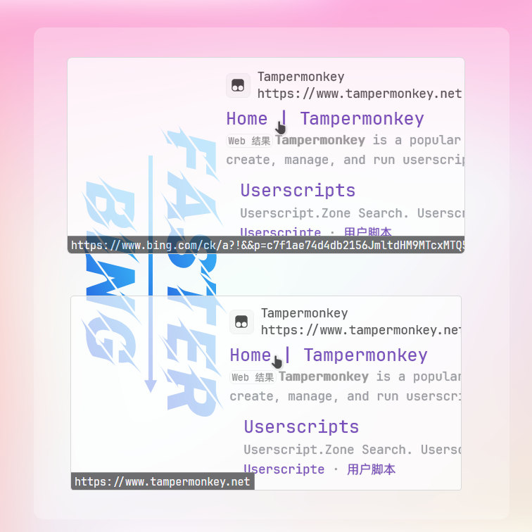
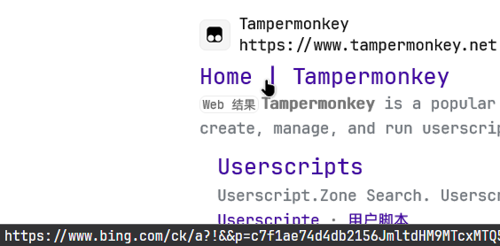
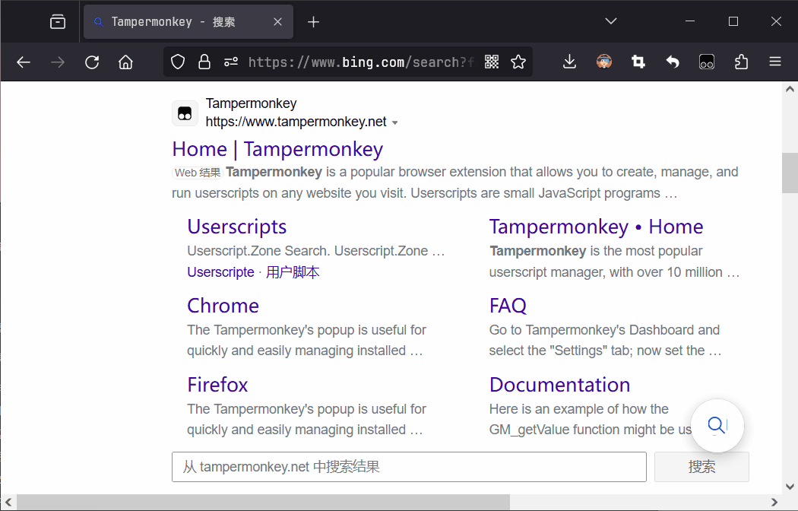
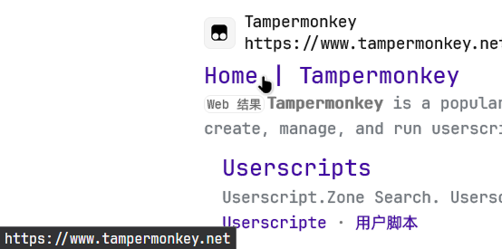
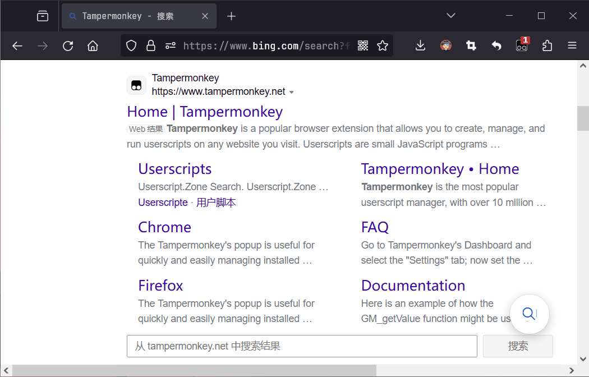

# <div align="center">Faster Bing</div>

<div align="center">
  
  
  
  
</div>

<div align="center">
    <a href="#">English</a> | <a href="README-zh.md">中文</a>
</div>

## 1. Introduction

When searching with Bing, Bing redirects the link to the search results to an intermediate page before jumping to the
target page. This intermediate page will add one more request, resulting in slower access.
This project modifies the redirect link to the target link to realize direct access to the target page of Bing search
results and speed up the access.

<div style="display: flex; justify-content: space-between;">
  
  
</div>

This project is based on Tampermonkey development, can be used in Chrome and Firefox and other browsers that support
Tampermonkey plugin.

### 1.1 Comparison

|                    |  Bing   | Faster Bing | Comparative Results |
|:------------------:|:-------:|:-----------:|:-------------------:|
| Link Intuitiveness | Clutter | At a Glance |     More Humane     |
|    Access Speed    | 🚲🚲🚲  |   🚀🚀🚀    |   `1184ms` faster   |

### 1.2 Before Installation

Before installation, the link to the Bing search results is shown below:

```text
https://www.bing.com/ck/a?!&&p=c7f1ae74d4db2156JmltdHM9MTcxMTQ5NzYwMCZpZ3VpZD0zYTZkZDUxMi0zN2FhLTYxYjUtMzJhNC1jN2UxMzZjYzYwNzYmaW5zaWQ9NTIwNQ&ptn=3&ver=2&hsh=3&fclid=3a6dd512-37aa-61b5-32a4-c7e136cc6076&u=a1aHR0cHM6Ly93d3cudGFtcGVybW9ua2V5Lm5ldC8&ntb=1
```



Clicking on it will take you to an intermediate page and then to the target page:



### 1.3 After Installation

After installing the Faster Bing script, the link to the Bing search results is shown below:

```text
https://www.tampermonkey.net/
```



Clicking on it will take you directly to the target page:



## 2. Usage

### 2.1 Installation of Tampermonkey

Check out the [Tampermonkey Home Page](https://www.tampermonkey.net/index.php?browser=chrome&locale=zh) for details on how to use it.

### 2.2 Installation of the Script

Visit the link: [Greasy Fork - Faster Bing](https://greasyfork.org/en/scripts/490999-faster-bing) and
click `Install this script` to install the script.

### 2.3 Usage of the Script

The Faster Bing script will take effect automatically without manual operation. When you use Bing search, click on the
search result link, and you will be taken directly to the target page.

## 3. Principle

When using Bing search, the parameter `u` of the jump link of Bing search is the target link encoded by Base64. We only
need to decode this parameter and then directly modify the `href` attribute of the link.

In the figure below, the red path is Raw Bing and the blue path is Faster Bing: you can see that Raw Bing needs to go
through an intermediate page, while Faster Bing can directly jump to the target page.


## 4. Feedback

If you have any questions or suggestions, please feel free to raise them
in [GitHub Issues](https://github.com/jiang-taibai/faster-bing/issues)
or [Script Feedback Area](https://greasyfork.org/zh-CN/scripts/490999-faster-bing/feedback).

## 5. Future Plan

- [x] Optimized link modification: For some special links, special handling may be required. (Thanks to [@Dqgfh](https://github.com/Dqgfh) for optimizing the logic for handling links.)
- [ ] Internationalization: Scripts support multiple languages (logs, hints, etc.).

## 6. Contributor ✨.

<p>
  
</p>


## 7. Open Source License

This project follows the [MIT](https://opensource.org/licenses/MIT) open source protocol.

CopyRight © 2024~Present [Jiang Liu](https://coderjiang.com)
